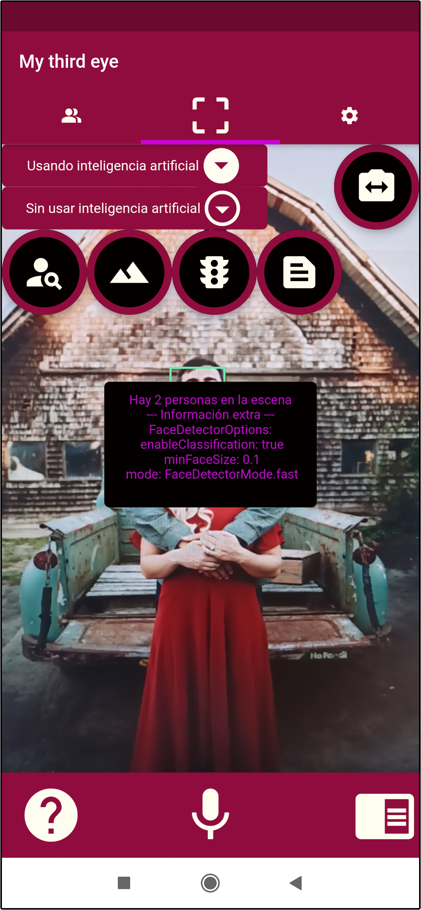

# My Third Eye

Portfolio of the MyThirdEye's project. 

---
## Table of contents:
- [What is _My Third Eye_?](#what-is-my-third-eye)
- [Motivations](#motivations)
- [Software used for development](#software-used-for-development)
- [How it works](#how-it-works)
- [Case examples](#case-examples)
- [Requirements](#requirements)
- [Installing the app](#installing-the-app)
- [License](license)

---
## What is _My Third Eye_?
_My Third Eye_ is the resulting application of a Cordoba's university final degree project. Developed by:
- Student: Pablo García Ruiz.
- Tutor: [Manuel Jesús Marín Jiménez](https://github.com/mjmarin).

It's an app that provides **vision-based assistive functionalities** by means of machine vision and is intended to be used primarily by **people** who are **visually impaired**.

---
## Motivations
The motivations for the project are as follows:
- To create an application to help overcome visual impairment.
- Research into the needs of visually impaired people and the functionalities that can be used to meet them.
- Study of the tools needed to work with artificial vision in a mobile environment.
- Study and research into existing scene description techniques, among others, for their application in mobile environments with low computational resources.
- Experimentation in a real environment, with different iterations where the user experience is considered and improved.

---
## Software used for development
<table>
  <tr>
    <td>Main programming language</td>
    <td><a href="https://dart.dev/" >Dart</a></td>
  </tr>
  <tr>
    <td>Framework</td>
    <td><a href="https://flutter.dev/">Flutter</a></td>
  </tr>
  <tr>
    <td>Main libraries</td>
    <td>
      <li><a href="https://firebase.google.com/">Firebase</a></li>
      <li><a href="https://firebase.google.com/">Tensorflow</a></li>  
    </td>
  </tr>
</table>

In order to develop the detection of different types of objects, it has been used the artificial intelligence model: [SSD Mobilenet V3 Small Coco](https://github.com/tensorflow/models/blob/master/research/object_detection/g3doc/tf1_detection_zoo.md#mobile-models).

---
## How it works
_My Third Eye_ offers the following functionalities and features:
- Recognise the number of people.
- Recognise a varied set of object types.
- Recognise text.
- Recognise ambient light level.
- Recognise colour.
- (Experimental) Recognise zebra crossings and traffic lights.
- Operate it completely, using voice and touch.
- Configurable interface and behaviour.
- Configuration saved on device.
- Continuous access to:
  - A help functionality.
  - An screen reader functionality.
  - Recognise voice commands.
  - All application windows.

--- 
## Case examples

<table>
  <tr>
    <td></td>
  </tr>
  <tr>
    <td>Recognition: Number of people</td>
  </tr>
</table>

If you want to see some explained examples, take a look on the _user manual_ part [1](https://github.com/PGR-TFG/MyThirdEye-Page/blob/main/doc/User_manual_pt1.pdf):

<iframe src="https://drive.google.com/file/d/165snBWlPOkAaA_k36XBkoNAjHIfl-Wjw/preview" width="95%" height="450px"></iframe>

And part [2](https://github.com/PGR-TFG/MyThirdEye-Page/blob/main/doc/User_manual_pt2.pdf):

<iframe src="https://drive.google.com/file/d/1AIpedd59Cp1gMzLAXhK66rbddbslqXlU/preview" width="95%" height="450px"></iframe>

---
## Requirements
### Software requirements
- **Operating system**: The target mobile device must have the Android operating system.
- **Version**: The minimum supported version is Android 5.0.
- **Permissions**: In order to fully use the application, it must be given permissions to use the camera and microphone.

### Hardware requirements
- **Accessories**: The device must have a front and a rear camera, for visual recognition. In addition, it shall have a microphone for reading out voice commands.
- **Sensors**: The device must have a light sensor, if ambient light level recognition is to be implemented.
- **Storage space**: At least 300 MB of free space is required for installation and use.

---
## Installing the app
The installation process is temporarily enabled through Google Drive, via this [download link](https://drive.google.com/file/d/1_XSdzsMNajA4UR3JYV6mM7767DymVHcK/view?usp=sharing). It is installed by clicking on the downloaded _.apk_ file.

---
## License
Released under [MIT License](https://en.wikipedia.org/wiki/MIT_License).

